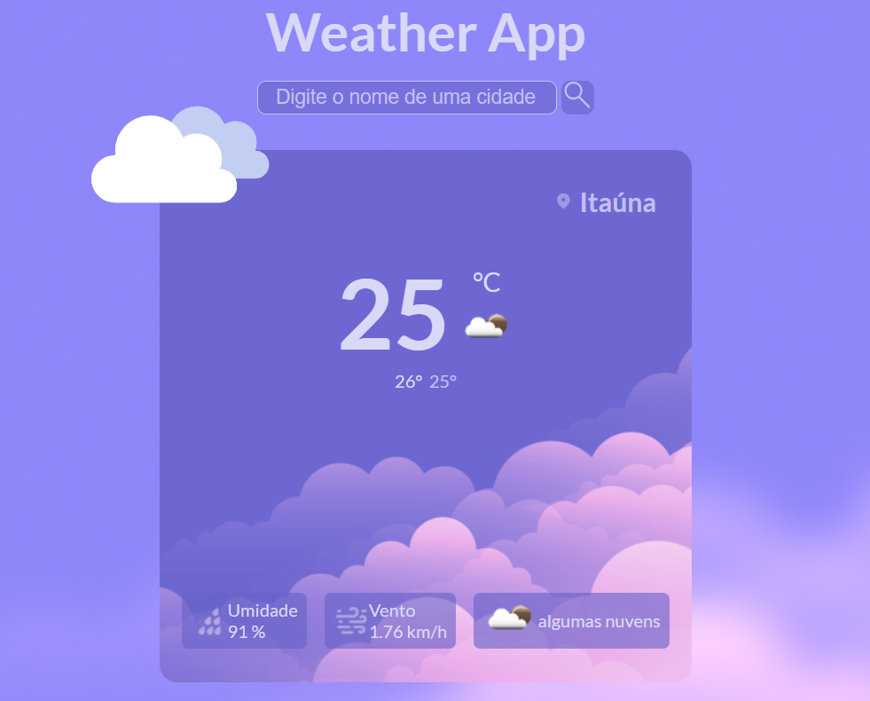

# Weather-App
Este é um aplicativo de previsão do tempo moderno e fácil de usar. Ele permite que você consulte o clima em sua localização atual ou em qualquer outra cidade do mundo. O aplicativo exibe informações detalhadas sobre o clima, incluindo a temperatura atual, a máxima, a mínima, a umidade e a velocidade do vento. Além disso, ele apresenta informações visuais atraentes, como ícones de clima e bandeiras dos países. Com este aplicativo, você sempre estará preparado para o clima, independentemente de onde esteja.

  <a href="#-tecnologias">Tecnologias</a>&nbsp;&nbsp;&nbsp;|&nbsp;&nbsp;&nbsp;
  <a href="#memo-licença">Licença</a>

  

 

  

## 🚀 Tecnologias

Esse projeto foi desenvolvido com as seguintes tecnologias:

- React.js
- HTML e CSS

## :memo: Licença

Esse projeto está sob a licença MIT.

---

# Instalação
## Clone este repositório em sua máquina local:
~~~javascript
git clone https://github.com/eldinho2/Weather-App.git
~~~
## Acesse o diretório do projeto:
~~~javascript
cd Weather-App
~~~
## Instale as dependências do projeto:
~~~javascript
npm install
~~~
## Inicie o aplicativo em modo de desenvolvimento:
~~~javascript
npm start
~~~
#### O aplicativo será aberto em http://localhost:3000 no seu navegador padrão.
